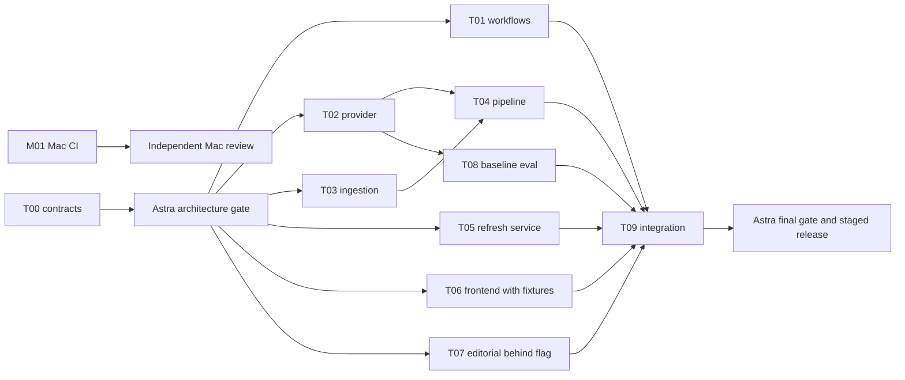

# News: implementation and agent allocation plan

Prepared 23 September 2026. Target application model: **GPT-6 Luna**. This is a plan, not an implementation. No production settings, budgets, workflows, credentials or application code were changed. No paid model evaluations were run.

**Recommended order:** contain the Mac CI usage; fix News scheduling and publication health; implement Luna and the protected refresh action; evaluate and release; then improve editorial selection and offline reading. Keep the current static website, Python builder, GitHub Actions and Cloudflare scheduler.

The original [repository review](../News-review-2026-09-23.md) covers News at commit `5aad7f4c4b5083b7525311307b96a0d3f9115c9d`. Agents must check the current branch before editing. Do not overwrite newer work. The [cost evidence](../news-cost-evidence.json) contains the seven-edition token sample. This plan adds authenticated account billing and Mac workflow investigation.

## Where the 2,000 Actions minutes went

The account's September billing breakdown identifies **the private `meeting-transcription-mac` repository as the allowance consumer**. News is public and uses standard Linux runners.

| Repository / runner | Usage displayed for September | Gross value | Billed amount displayed |
|---|---:|---:|---:|
| meeting-transcription-mac / macOS 3-core | 193.55 minutes | $12.00 | $0.00 |
| News / Linux | 224 minutes | $1.34 | $0.00 |
| session | Small additional usage | $0.05 | $0.00 |

These are the values shown in [your billing usage page](https://github.com/settings/billing/usage), inspected September 23. Gross value is not an invoice. The Actions account budget is **$0, with Stop usage = Yes**, as verified in [Budgets](https://github.com/settings/billing/budgets). Preserve that setting unless you deliberately choose to buy additional usage. The screenshot says the allowance resets October 1, 2026.

At current published rates, Linux is $0.006/minute and standard macOS is $0.062/minute. Thus 2,000 Linux minutes represent $12; the dashboard's 193.55 Mac minutes also represent approximately $12. This reconciles the alert economically: the allowance is not 2,000 actual Mac clock minutes. The billing quantity should not be treated as an exact sum of every job's wall time; rounding and allowance allocation affect reconciliation. [GitHub runner pricing](https://docs.github.com/en/billing/reference/actions-runner-pricing).

Standard runners for public repositories are free, so News's gross Linux usage does not explain the exhausted private-repository allowance. Artifact and cache storage have separate rules. [GitHub Actions billing](https://docs.github.com/en/billing/concepts/product-billing/github-actions).

Recent Mac failures have no executed steps and a billing/spending-limit annotation. That is consistent with the verified stop-usage budget; the generic annotation also mentions payment problems, but it is not evidence that a payment failed. Re-running blocked jobs will not repair application code or replenish the allowance.

### The expensive Mac workflow

`meeting-transcription-mac/.github/workflows/harness-mac.yml` runs on main pushes, pull requests and manual dispatch. It uses `macos-26`, has a 180-minute timeout, and repeats release compilation, tests, an AddressSanitizer build and a smoke run. It has no concurrency cancellation or dependency cache. The inspected run list contains many runs concentrated on September 22–23, including successful jobs around 17–20 minutes.

Representative [successful run 35771569936](https://github.com/grroo/meeting-transcription-mac/actions/runs/35771569936):

| Step | Elapsed time |
|---|---:|
| Whole Mac job | 18m 13s |
| Release build | 2m 46s |
| Unit tests | 1m 03s |
| Sanitizer build | 1m 05s |
| Sanitizer smoke step | **12m 14s** |

The smoke step accounts for about **67%** of that job. The 547 MiB model download completes in about **9 seconds**. Logs then have an approximately **11m 31s gap before the first Whisper initialization message**. The cause of that gap is not established: instrument application startup and engine initialization before prescribing a fix. Caching the downloaded model alone cannot save those eleven minutes.

The smoke fixture is a short silence clip used for a memory-lifetime check. Preserve its intended coverage. A smaller model or isolated engine path may be appropriate only after demonstrating that it still exercises the relevant code. Do not simply remove the sanitizer or treat an expected short-input error as proof that every desired path ran.

An 18m 13s single job rounds to 19 billable minutes under published rounding rules: approximately **$1.18 gross per run**. Ten such runs are nearly the account's $12 equivalent allowance. Cutting an example job from 19 to 7 rounded minutes would reduce its compute by about 63%; that is an illustration, not a measured achievable result. Reducing redundant heavy runs can save more than build caching alone. Give [M01](tasks/M01-mac-actions.md) its own agent and repository.

## Target behavior and priorities

| Priority | Change | Reason |
|---|---|---|
| P0 | Reduce unnecessary Mac CI; preserve $0 stop budget | This is the actual account-allowance problem. |
| P0 | One News scheduler, explicit paid-generation triggers | Six observed editions/day versus three intended; UI edits also regenerate content. |
| P0 | Truthful section health and last-good content | Current `mode=llm` can hide total provider failure. |
| P1 | GPT-6 Luna provider adapter and measured usage | Model-name substitution cannot change an Anthropic-only implementation. |
| P1 | Authenticated manual fetch with shared limits | Make the button useful without exposing credentials or unlimited dispatch. |
| P1 | Feed/price fallback, dependency maintenance and PR checks | Fix reproduced failures and close validation gaps. |
| P2 | Better candidate selection, archive retention, offline UX | Improve usefulness after the core path is reliable. |

The cheap existing action becomes **Check for updates**: read already published JSON. The owner action becomes **Fetch new briefing**: authenticate, reserve a job, fetch feeds and prices, generate changed sections, publish, and confirm that exact request. Keep the old briefing visible during work. Recent full News runs took roughly 1–3 minutes, but queues and failures can extend that.

Prefer a Cloudflare Access-protected owner control page on the Worker's origin for the first release. Link to it from the app and provide a return link. The first visit may require sign-in; fetching requires an explicit authenticated POST. This avoids making cross-site login cookies a hidden dependency of the public GitHub Pages app. T00 must verify the account/domain can support this arrangement; T05 must validate the identity token server-side. A direct in-page authenticated action is acceptable if its browser flow is proved early, not assumed. No public GET or ordinary page visit may initiate paid work.

Proposed configurable defaults: one active generation job; 15-minute manual cooldown; at most five manual requests/day; a shared ceiling of eight generation runs/day with capacity reserved for remaining scheduled slots. Retries consume the shared allowance, so five manual runs are a maximum, not a guarantee on failure days. Count provider attempts separately; start with at most one transient retry per failed section. Use a bounded request timeout. A scheduled and manual request arriving together must coalesce when the same work can satisfy both, with explicit request-to-result mapping.

All paid entry points, including privileged workflow dispatch, must pass the same budget/idempotency gate. A failed deployment should redeploy the committed result, not pay to regenerate it. These rules require an integration contract between the Worker, workflow and builder; they are not frontend-only limits.

## Luna migration and expected running cost

Mean measured workload: 13,795.29 input tokens and 2,479 output tokens per full edition, across three successful section calls. At equal token volumes, current standard short-context prices give:

| Scenario, 30 days | Haiku 4.5 | GPT-6 Luna |
|---|---:|---:|
| One complete edition | $0.02619 | $0.00262 |
| Three scheduled editions/day | $2.36 | $0.24 |
| Three scheduled + one manual/day | $3.14 | $0.31 |
| Three scheduled + five manual/day | $6.29 | $0.63 |

Haiku is $1 input / $5 output per million tokens; Luna is $0.10 / $0.50. At equal usage this is a 90% reduction, but only about $2.12/month saved at three editions/day. These are estimates, not invoices or measured Luna results. Tokenization, output length, reasoning, retries and caching can change them. Sources: [Anthropic pricing](https://platform.claude.com/docs/en/about-claude/pricing), [OpenAI pricing](https://developers.openai.com/api/docs/pricing).

The new button's extra API expense is small at personal usage. One additional full fetch every day adds about $0.079/month on Luna. GitHub compute remains free for News's current public/standard-runner setup. Cloudflare account plan and authentication charges were not verified; validate existing allowances before adding a subscription. No infrastructure migration is justified solely by these small API savings.

Implement a small provider adapter with OpenAI Responses and strict structured output. Preserve the Anthropic adapter for explicit rollback. Use `gpt-6-luna` and explicitly set reasoning effort to `none` for the application baseline; test `low` only if quality warrants it. This differs from coding-agent reasoning settings below. Handle refusals, incomplete responses, retries and normalized usage. Unknown models must have unknown price rather than silently inheriting Sonnet rates. Preserve source-ID and duplicate checks after schema validation. [Luna documentation](https://developers.openai.com/api/docs/models/gpt-6-luna), [structured outputs](https://developers.openai.com/api/docs/guides/structured-outputs).

Use 20 representative complete input snapshots, including all three AI sections, multilingual feeds, busy/quiet periods and feed failures. First compare Haiku and Luna with the same candidate selection; then evaluate any ranking changes separately. Archive outputs cannot reconstruct all original candidates. At the observed volumes, 20 complete editions on both models together project to about **$0.58** in provider calls before retries/reasoning. Human or strong-model review is additional.

Release gates: 100% schema/citation invariants on the evaluation set; no critical unsupported factual or numerical claims; source preferences preserved; no material aggregate quality regression under an agreed rubric; actual latency and cost recorded. This is a small acceptance sample, not proof of universal correctness. Keep Haiku selectable until a seven-day Luna canary is reviewed. Do not automatically call both providers for every production failure.

## Model allocation: spend quota on judgment, not repetition

These assignments are recommendations for this codebase, not a claim that models have been benchmarked against one another here. Choose the cheapest suitable model in a pool where you have capacity. Cursor quota, ChatGPT/Codex quota, API credits and GitHub minutes are separate; model list prices do not convert directly into your subscription's remaining messages or tokens.

| Model | Recommended use | Setting |
|---|---|---|
| Composer 2.5 | Mechanical extraction, workflows, UI, fixture/test plumbing, docs | **Standard**, not Fast; short explicit task brief |
| GPT-6 Luna | Small isolated fixes, schemas, deterministic helpers, fixture work | Low for simple work; medium for bounded multi-file work |
| Grok 4.7 | Provider integration, ingestion, pipeline changes | Medium normally; high for auth/concurrency work |
| GPT-6 Sol | Difficult debugging and independent integration/security review | Medium for implementation; high for focused review |
| Claude Sonnet | Alternative to Grok/Sol when its quota is available | Normal effort for implementation; elevated effort for hard review if exposed |
| GPT-6 Astra | Approve shared architecture once; final release review once | High; reserve xhigh for a specific unresolved difficult decision |

Composer's standard list rates are $0.50/$2.50 per million input/output tokens; Fast is $3/$15 and is the product default. Selecting Standard is a concrete quota-saving measure where available. [Composer pricing](https://prod.cursor.com/docs/models/cursor-composer-2-5).

Grok 4.7 lists $2/$6 with high reasoning as its default; select medium for ordinary tasks if your client exposes the setting. GPT-6 Sol lists $2/$10, Astra $10/$50, and Luna $0.10/$0.50 at standard short-context rates. These rates exclude caching and product-specific subscription accounting. [Grok documentation](https://docs.x.ai/developers/models/grok-4.7), [OpenAI pricing](https://developers.openai.com/api/docs/pricing).

Cursor documents a shared Cursor Models pool for Composer and Grok, separate from its other-model pool. Switching Composer to Grok may therefore consume the same pool. Check your actual plan before assuming it preserves quota. Do not use automatic routing when you need predictable model allocation. [Cursor usage and limits](https://prod.cursor.com/help/models-and-usage/usage-limits).

Use no more than **three implementation agents concurrently**. Give each its task packet, the shared contract, and relevant files—not this entire investigation and all logs. Aim for 5–12k tokens of initial context for routine tasks and 10–20k for complex ones; these are context targets, not total billed-token guarantees. Keep compact handoffs with changed files, decisions, tests, failures and remaining risks. After two failed repair attempts at the same issue, escalate with the smallest reproduction instead of extending a cheap model's unproductive loop.

Reserve roughly 20% of your available development quota for independent review and fixes, and another 10% for Astra's two decision gates. The remaining 70% funds implementation. This is an allocation of your available weighted quota, not a promise that raw tokens cost the same across models. Do not spend premium review quota on repeated formatting edits or have multiple models independently re-audit the whole repository.

## Task map and parallel execution

Each link is a self-contained assignment to give one agent, together with [COMMON.md](COMMON.md). The listed ownership applies after T00's small mechanical extraction. New filenames are proposed, not claims about existing files.

| ID | Task / ownership | Builder | Independent review | Dependencies |
|---|---|---|---|---|
| [M01](tasks/M01-mac-actions.md) | Mac CI usage, separate repository | Grok 4.7 medium | Sol high | None |
| [T00](tasks/T00-contracts.md) | Contracts, minimal extraction, fixtures | Composer Standard; Sol medium if design ambiguity | Astra high, bounded architecture gate | None |
| [T01](tasks/T01-workflows.md) | News workflows, slot guard, Python lock | Composer Standard | Sol medium | T00 for final interfaces |
| [T02](tasks/T02-provider.md) | Provider adapter and provider tests | Grok medium or Luna medium | Sol high | T00 |
| [T03](tasks/T03-ingestion.md) | Feeds, price retrieval, ingestion tests | Grok medium | Sol medium | T00 |
| [T04](tasks/T04-pipeline.md) | Builder integration, health, cache, costs, archives; config | Grok high or Sol medium | Sol high | T00; T02/T03 to integrate |
| [T05](tasks/T05-refresh-service.md) | Cloudflare scheduler, authenticated refresh, DO, Worker dependencies | Grok high or Sol high | Sol high; Astra only unresolved decisions | T00; integrates with T01/T04 |
| [T06](tasks/T06-frontend.md) | Static frontend and browser tests | Composer Standard | Sol medium | T00 fixtures; T04/T05 for live integration |
| [T07](tasks/T07-editorial.md) | Candidate ranking and deduplication | Luna medium or Composer Standard | Sol medium | T00; release after baseline Luna evaluation |
| [T08](tasks/T08-evaluation.md) | Reproducible eval harness and evidence | Composer Standard or Luna medium | Sol high | T02; T03/T04 for final inputs |
| [T09](tasks/T09-release.md) | Integration, release checks, operations docs | Sol high | Astra high, final gate | T01–T08 |

T00 is a short coordination prerequisite, not a framework rewrite. M01 proceeds independently. The scheduling-only part of T01 can be prepared immediately, but do not disable the only functioning scheduler without verifying the replacement.

With three slots: first T01/T02/T03; then T04/T05/T06; then T07/T08 plus integration preparation. Queue M01 in a slot from the start if Actions recovery is most urgent. T06 and T08 may begin against frozen fixtures before backend work merges. No task edits another task's owned files; send a small requested change to the owner. One integrator merges sequentially and runs combined checks. Each agent gets a separate branch/worktree based on the merged T00 commit.

## Integration contract to freeze in T00

1. **Edition metadata:** additive schema version; edition ID; generated timestamp; trigger; opaque request ID; scheduled slot when relevant; overall quality; per-section state, source timestamp and last-success timestamp. An edition can be published yet degraded. A last-good section retains its actual age. Mock output is explicitly separate from production.
2. **Provider result:** normalized content, provider/model, successful/failed status, retryability and usage. Usage includes input, cached input, output, reasoning details where reported, attempts, cost estimate and price-table version. Reasoning tokens must not be counted twice when already included in output totals. Preserve unknown usage for timed-out requests.
3. **Refresh API:** POST returns an opaque job ID and status location; duplicate idempotency keys return the same job; unauthenticated requests are denied; limit responses include retry time. Status distinguishes accepted, queued, building, publishing, succeeded, no-change, degraded, failed and expired. Success includes the exact published edition/request mapping.
4. **Shared reservation:** DO persists request identity, cooldown, daily counters, schedule reservations and dispatch state before an external call. Workflow validates or acquires an authorized reservation before paid generation. Reserve before work; release only when safe. A timeout after dispatch must reconcile the existing run, not dispatch blindly again. Keep privileged manual invocation possible through the same gate.
5. **Publication acknowledgment:** builder result records request IDs; status reconciles against actual Pages content. Workflow success alone is insufficient. A delayed old run must not overwrite a newer edition. Deployment-only retry is a separate action with no provider calls.
6. **Cache identity:** fingerprint candidate content, selection policy, model/provider, prompt version, interests and finance context. Reusing summaries preserves generation age while recording a new check time. Store bounded last-good feed data separately from public reading history. Define persistence across ephemeral GitHub runners explicitly.

Keep changes backward compatible with existing archived JSON where practical. Choose one small documented representation, checked with shared fixtures in Python and JavaScript. Avoid introducing a database service solely for contracts; reuse the existing Durable Object and deliberately persisted pipeline state. Do not rely on Actions caches as authoritative locks or a complete billing ledger.

## Rollout and rollback

1. **Containment:** complete M01's low-risk trigger/concurrency changes. Keep the $0 Actions budget. Profile the slow Mac path locally or in one explicitly budgeted diagnostic run; existing exhaustion may prevent hosted validation until reset. Report that limitation honestly.
2. **News reliability:** merge workflows, truthful health, price/feed repairs and dependency updates. Validate three intended slots across a full Rome day, including timezone/DST fixtures. Turn off duplicate cron only after confirming the deployed Worker is healthy. Keep the old model during this stage.
3. **Luna:** run fixture/contract tests, the paired evaluation, then switch the configured provider with Haiku rollback retained. Observe seven days; compare actual failures, spend, latency and editorial quality. No permanent dual-generation mode.
4. **Manual fetch:** enable owner authentication and server limits, exercise simultaneous clicks and scheduler overlap, then expose the app button. Test the exact Pages publication acknowledgment. If needed disable manual refresh independently of scheduled updates.
5. **Editorial/offline improvements:** enable selection changes only after separate evaluation. Roll out offline caching with schema/version invalidation and stale labels.

Rollback is a configuration switch to the old provider, disablement of the manual endpoint, and redeployment of a known-good static artifact. Preserve the new honest health semantics and spending limits. Retain enough previous compatible schema support for this to work. Never roll back by restoring the duplicate scheduler or silently publishing mock content.

Finish with a concise operating guide: current model, schedule, owner refresh, failure states, daily limits, measured versus estimated costs, cache/retention policy, secrets required, rollback steps and the public nature of interests/tickers and `seen.json`. The latter records published stories, not browser reading history. Moving personal preferences to private secret-backed configuration is optional and should be a distinct follow-up if desired.

Planning estimate: about **6–10 developer-days of total effort** for the core News changes and meaningful evaluation, with some work parallelizable; roughly 0.5–1.5 days for Mac workflow diagnosis/optimization depending on the unexplained startup delay. Three agents might deliver a reviewable integrated candidate in 3–5 working days, followed by the seven-day observation period. These are uncertain effort estimates, not predictions of autonomous agent runtime. The most economical first milestone is scheduling + health + provider adapter; offline and richer editorial changes can wait if quota runs low.

